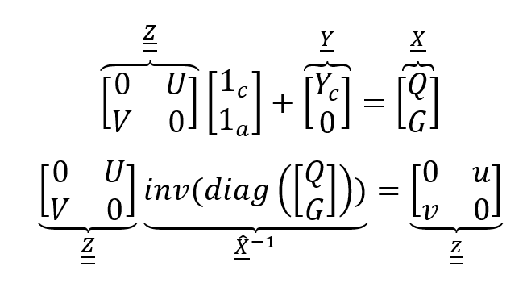

# Meso-Economic model for allocating GDP among sectors
The repository is complementing what is described in the paper _A multi-disciplinary approach to estimate the medium-term impact of COVID-19 on the energy system: a case study for Italy_ for what concerns the meso-economic modelling.
## Repository description
### Database
In this folder the EUROSTAT Supply and Use Table (SUT) for Italy are reported in row format (in 'Database/EUROSTAT' where also the consumption_trend.py module for extrapolating trends in final demand shares on the basis of 2010-2016 values) and CVX_SUT format (the excel files in 'Database' for 2014, 2015 and 2016 which are used for feeding the Leontief Kantorovich optimiztion model) are present. In this folder on can also find the Aggregation.xlsx file, which can be used for aggregating the results on the basis of any aggregation choice. Here two aggregation are used for presenting results, one based on the sectors adopted in the Energy Model (Integration), one for analysing the results (Analysis).
In this case, input-output coefficients have been obtained by simply dividing supply (_V_) and use (_U_) matrices (collectively identifiable as _Z_) by the resulting vector of total outputs of commodities (_Q_) and industrial activities (_G_). In this way, industry related assumption (i.e. input-structure of an industry is invariant irrespective of its product-mix) is implicitly assumed, as here shown:

Where:
*	_1c_ and _1a_ are two row summation sub-vectors, one for commodity (c) and one for activities (a); 
*	_Yc_ is the demand, which is clearly expressed by means of commodities; 
*	_u_ and _v_ form the supply and use coefficient matrices: u is called the (product-by-industry) use coefficients matrix (input structures), and v is called the (industry-by-product) market share matrix. 
In this way it is possible to express the represented economy by means of coefficients which are showing the following: from the one hand how much inputs of commodity are required to produce one unit of industrial activity (_u_) and, from the other hand, how much activity production is needed by each industrial activity for every one unit of a certain commodity (_v_). Getting coefficients from the other matrices is straightforward: all of them are divided by the same vector of total output (_X_).
Note that a variable with one underline identifies a vector, while one with double underline identifies a matrix. 

### REP_CVX 
In this folder the module for managing input-output model and its dedicated readme file can be found. This step of the work is taking advantage of REP_CVX, a python module developed by REP research group in Fondazione Eni Enrico Mattei with the aim to provide an open-source tool for performing **Input-Output** analysis based on the **Supply and Use Framework**. A 
The approach is grounded on the use of Supply and Use Framework as described by Lenzen and Rueda-Cantuche in _A note on the use of supply-use tables in impact analyses_.
### Results
In this folder the results are stored. Each run generates 4 htlm charts and 1 excel files. For each aggregation a dedicated folder can be found.
### Inputs
In this folder an excel file for managing the non-database exogenous parameters for the Leontief model is present. In the README sheet a detailed presentation of the sheets is presented.
